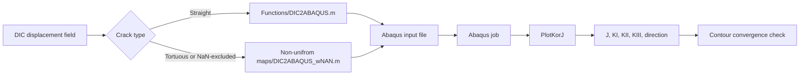

<p align="center">
  <h1 align="center">DIC2ABAQUS</h1>
  <p align="center">
    <strong>From experimental DIC displacement fields to Abaqus fracture mechanics models.</strong><br>
    Compute <em>J</em>-integrals and mixed-mode stress-intensity factors from 2D and 3D-stereo DIC data, including straight, tortuous, isotropic, anisotropic, elastoplastic, and UMAT-driven workflows.
  </p>
</p>

<p align="center">
  <a href="https://github.com/Shi2oon/DIC2ABAQUS"></a>
  <a href="https://github.com/Shi2oon/DIC2ABAQUS/blob/master/LICENSE"></a>
  <a href="https://doi.org/10.1016/j.softx.2025.102231"></a>
  <a href="https://github.com/TarletonGroup/CrystalPlasticity"></a>
</p>

---

## What is DIC2ABAQUS?

**DIC2ABAQUS** is a MATLAB workflow that converts pre-acquired Digital Image Correlation (DIC) displacement fields into Abaqus finite-element models for fracture-mechanics analysis. It is designed for cases where the experimental displacement field is the primary boundary condition, rather than a prescribed analytical load or a simple specimen geometry.

The code can be used to estimate:

- strain energy release rate, **J**;
- mixed-mode stress-intensity factors, **K<sub>I</sub>**, **K<sub>II</sub>**, and, where stereo data are available, **K<sub>III</sub>**;
- virtual crack-extension direction;
- contour-dependent convergence of fracture parameters.

The workflow supports elastic, Ramberg-Osgood, anisotropic, and user-material based simulations. The repository also includes an **OXFORD-UMAT** folder for crystal-plasticity workflows in Abaqus.

---

## Why use it?

Most fracture workflows require a clean specimen geometry, idealised loading, or hand-built finite-element models. DIC2ABAQUS instead starts from the measured displacement field and builds the Abaqus model around it.

| Capability | What it gives you |
|---|---|
| DIC-driven FE model generation | Converts full-field displacement data into Abaqus-compatible input files. |
| Straight and tortuous crack workflows | Uses separate examples for automatically handled straight cracks and pre-excluded tortuous cracks. |
| 2D and 3D-stereo DIC support | Computes in-plane modes and, where available, mode III. |
| Material flexibility | Supports elastic, Ramberg-Osgood, anisotropic elasticity, and UMAT material definitions. |
| EBSD integration | Supports anisotropic and UMAT workflows using EBSD orientation data through MTEX. |
| Abaqus post-processing | Extracts **J**, **K<sub>I</sub>**, **K<sub>II</sub>**, **K<sub>III</sub>**, and crack-extension direction from the Abaqus results. |

---

## Repository layout

```text
DIC2ABAQUS/
├── Functions/                         # Main regular-grid DIC2ABAQUS workflow
│   ├── DIC2ABAQUS.m                   # Main driver for regular DIC maps
│   ├── Locate_Crack.m                 # Crack localisation for straight-crack workflow
│   ├── PrintRunCode.m                 # Abaqus job generation and execution helper
│   ├── PlotKorJ.m                     # J and SIF extraction from Abaqus output
│   └── ...
│
├── Non-unifrom maps/                  # Non-uniform or crack-excluded maps
│   ├── DIC2ABAQUS_wNAN.m              # Main driver for fields containing NaNs or removed crack regions
│   ├── WhatNaN.m                      # Removes invalid/cracked regions from the mesh
│   ├── Meshing.m                      # 2D mesh generation from DIC points
│   ├── MeshPlaneStress3D.m            # Extrudes 2D maps into 3D models
│   └── ...
│
├── OXFORD-UMAT/                       # Crystal-plasticity UMAT resources for Abaqus
│   ├── OXFORD-UMAT v3.3/
│   ├── Documentation/
│   └── README.md
│
├── Miscellaneous/                     # Example data and helper files
├── EBSDsquareExample.mat              # Example EBSD data
├── InputDesk_Validate.m               # Synthetic validation example
├── Straigh_Crack_input_Desk.m         # Straight-crack example
├── Tortuous_Crack_input_Desk.m        # Tortuous-crack and UMAT example
├── Abaqus units.png                   # Unit reference figure
└── README.md
```

> **Note on folder names:** the repository currently uses the spelling `Non-unifrom maps` and `Straigh_Crack_input_Desk.m`. Keep those names unless you also update every path reference in the scripts.

---

## Requirements

### Required for basic elastic examples

- MATLAB
- Abaqus/CAE with command-line execution available
- A DIC displacement field in a compatible table or matrix format

### Required for UMAT or crystal-plasticity workflows

- Abaqus linked to a compatible Fortran compiler
- OXFORD-UMAT source files, included in the repository under `OXFORD-UMAT/`
- Correct Abaqus command shortcut path in the input desk
- EBSD data if running anisotropic or crystal-plasticity workflows
- MTEX if EBSD orientation data are being read or interpolated

### Optional but useful

- Image Processing Toolbox, depending on your preprocessing path
- MTEX 6.x for EBSD workflows
- A clean DIC export with columns such as:

```text
X   Y   Ux   Uy
```

For stereo-DIC workflows, additional columns or fields may be used for `Z` and `Uz`.

---

## Installation

Clone the repository:

```bash
git clone https://github.com/Shi2oon/DIC2ABAQUS.git
cd DIC2ABAQUS
```

Open MATLAB in the repository root and add the relevant folders:

```matlab
addpath(genpath(fullfile(pwd, 'Functions')));
addpath(genpath(fullfile(pwd, 'Miscellaneous')));
```

For tortuous cracks or crack-excluded maps:

```matlab
addpath(genpath(fullfile(pwd, 'Non-unifrom maps')));
addpath(genpath(fullfile(pwd, 'Miscellaneous')));
```

For EBSD or UMAT workflows, make sure MTEX is available before running the input desk:

```matlab
% Example only. Change this to your MTEX installation path.
run('C:\path\to\mtex-6.0.0\startup_mtex.m')
```

---

## Quick start

### 1. Validate the code with synthetic data

Run the validation desk:

```matlab
InputDesk_Validate
```

This generates a synthetic displacement field and passes it to the main driver:

```matlab
Maps = Calibration_2DKIII(5, 1, 3);
Maps.Mat = 'Calibration';
Maps.type = 'E';
Maps.input_unit = 'um';
Maps.pixel_size = 1;
Maps.Operation = 'DIC';
Maps.stressstat = 'plane_stress';
Maps.unique = 'Calibration';

[J, KI, KII, KIII] = DIC2ABAQUS(Maps);
```

Expected outputs include:

```text
J_KI_II_III.fig
J_KI_II_III.tif
DIC2CAE.mat
```

Use this example before changing material models, DIC units, or Abaqus paths.

---

### 2. Run a straight-crack DIC example

Use:

```matlab
Straigh_Crack_input_Desk
```

This workflow is intended for straight cracks where the crack region does not need to be manually removed before running the code.

The key settings are:

```matlab
Maps.input_unit = 'mm';
Maps.pixel_size = 1;
Maps.Operation = 'DIC';
Maps.stressstat = 'plane_stress';
Maps.unique = 'Calibration';
Maps.type = 'E';
```

For a basic elastic material:

```matlab
Maps.Mat = 'Ferrite';
Maps.E = 220e9;
Maps.nu = 0.3;
```

Then run:

```matlab
[J, KI, KII, KIII] = DIC2ABAQUS(Maps);
```

---

### 3. Run a tortuous-crack or crack-excluded map

Use:

```matlab
Tortuous_Crack_input_Desk
```

This workflow is intended for curved, tortuous, or non-standard cracks where the cracked region has already been excluded from the displacement field, usually by setting the invalid/cracked region to `NaN` before meshing.

Typical settings:

```matlab
resultsDir = fullfile(pwd, 'Miscellaneous', 'Tortuous_Crack_Data.dat');

Maps.input_unit = 'um';
Maps.pixel_size = 1e-3;
Maps.Operation = 'DIC';
Maps.stressstat = 'plane_stress';
Maps.modelDimension = '2D';
Maps.modelThickness = 3e-3;
Maps.zElems = 3;
Maps.unique = 'Crack_in_Al_5052';
```

Run the non-uniform map workflow:

```matlab
[BCf, Maps.UnitOffset, Maps.stepsize] = DIC2ABAQUS_wNAN( ...
    Maps, ...
    [1375 955] * Maps.pixel_size, ...   % crack-tip estimate [x y]
    resultsDir, ...
    180);                               % virtual crack-extension direction

ABAQUS = PrintRunCode(Maps, Maps.results);
[J, K, KI, KII, Direction] = PlotKorJ(ABAQUS, Maps.E, Maps.UnitOffset);
```

The script then plots and saves the fracture parameters:

```matlab
plotJKIII(KI, KII, [], J, Maps.stepsize, Maps.input_unit)
saveas(gcf, [Maps.results '\' Maps.unique '_J_KI_II.fig']);
saveas(gcf, [Maps.results '\' Maps.unique '_J_KI_II.tif']);
```

---

## Material models

Set the material model using:

```matlab
Maps.type = 'E';   % Elastic
Maps.type = 'R';   % Ramberg-Osgood
Maps.type = 'A';   % Elastic-anisotropic
Maps.type = 'U';   % UMAT user material
```

### Elastic material

```matlab
Maps.type = 'E';
Maps.Mat = 'Al_5052';
Maps.E = 70e9;
Maps.nu = 0.321;
```

### Ramberg-Osgood material

```matlab
Maps.type = 'R';
Maps.Mat = 'Al_5052';
Maps.E = 70e9;
Maps.nu = 0.321;
Maps.Exponent = 26.67;
Maps.Yield_offset = 1.24;
Maps.yield = 4e9;
```

### Elastic-anisotropic material

```matlab
Maps.type = 'A';
Maps.Mat = 'Anisotropic_Al_5052';
Maps.Stiffness = [
    283 121 121 0 0 0;
    121 283 121 0 0 0;
    121 121 283 0 0 0;
    0 0 0 81 0 0;
    0 0 0 0 81 0;
    0 0 0 0 0 81] * 1e9;
Maps.nu = 0.30;
Maps.E = 210e9;                       % reference value for post-processing
Maps.EBSDfilename = 'EBSDsquareExample.mat';
Maps.Reigstered = 0;                  % 1 if EBSD and DIC are already registered
```

### UMAT material

Use this path when Abaqus should call a user material, for example OXFORD-UMAT:

```matlab
Maps.type = 'U';
Maps.Mat = 'UserDefined_Al_5052';
Maps.depvar = 50;
Maps.materialID = 1;                  % 1 = bcc, 2 = fcc, 3 = hcp
Maps.PROPS = 0;                       % check the UMAT documentation
Maps.Reigstered = 0;
Maps.EBSDfilename = 'EBSDsquareExample.mat';
Maps.E = 210e9;                       % reference value for post-processing

Maps.UMATfilepath = fullfile( ...
    pwd, ...
    'OXFORD-UMAT', ...
    'OXFORD-UMAT v3.3', ...
    'OXFORD-UMAT.f');

Maps.abqCmdShortcutPath = [ ...
    'C:\ProgramData\Microsoft\Windows\Start Menu\Programs\', ...
    'Dassault Systemes SIMULIA Abaqus CAE 2017\', ...
    'Abaqus Command.lnk'];
```

Check the following before running UMAT jobs:

1. Abaqus can run from the command line.
2. Abaqus is linked to a working Fortran compiler.
3. `Maps.UMATfilepath` points to the correct `.f` file.
4. `usermaterials.f`, `userinputs.f`, and `useroutputs.f` are configured consistently with the material ID and `PROPS` mode.
5. EBSD data are in the expected coordinate system and unit system.

---

## Important input fields

| Field | Meaning | Example |
|---|---|---|
| `Maps.X`, `Maps.Y` | DIC coordinate grids | `RawData.X1`, `RawData.Y1` |
| `Maps.Ux`, `Maps.Uy` | DIC displacement components | `RawData.Ux`, `RawData.Uy` |
| `Maps.Z`, `Maps.Uz` | Optional stereo-DIC coordinate and out-of-plane displacement | `RawData.Z1`, `RawData.Uz` |
| `Maps.input_unit` | Unit of the coordinates and displacements | `'m'`, `'mm'`, `'um'`, `'nm'` |
| `Maps.pixel_size` | Scaling factor if the DIC export is in pixels | `1`, `1e-3` |
| `Maps.Operation` | Type of input field | `'DIC'`, `'Strain'`, `'xED'` |
| `Maps.stressstat` | Abaqus element formulation | `'plane_stress'`, `'plane_strain'` |
| `Maps.modelDimension` | Non-uniform workflow model dimension | `'2D'`, `'3D'` |
| `Maps.modelThickness` | Thickness for extruded 3D models | `3e-3` |
| `Maps.zElems` | Number of elements through thickness | `3` |
| `Maps.type` | Material model | `'E'`, `'R'`, `'A'`, `'U'` |
| `Maps.unique` | Name used in output files | `'Crack_in_Al_5052'` |
| `Maps.results` | Output folder | `fullfile(pwd, 'Results')` |

---

## Output files

Depending on the workflow, DIC2ABAQUS writes:

| Output | Description |
|---|---|
| `*.inp` | Abaqus input file generated from the DIC field. |
| `Job-*` | Abaqus job directory or job prefix. |
| `DIC2CAE.mat` | MATLAB output containing `Maps`, `J`, `KI`, `KII`, `KIII`, and `Direction`. |
| `*_J_KI_II.fig` | MATLAB figure of J and SIFs for 2D workflows. |
| `*_J_KI_II.tif` | TIFF export of the same plot. |
| `*_corrected_J_KI_II.fig` | Corrected result after virtual crack-extension adjustment. |
| `*_DIC2ABAQUS Coodrinate.tif` | Crack-tip coordinate visualisation. |

A typical MATLAB output structure contains:

```matlab
J.true        % representative J value
J.div         % scatter or standard deviation over selected contours
KI.true       % representative mode-I SIF
KII.true      % representative mode-II SIF
KIII.true     % representative mode-III SIF, if stereo data are used
Direction.true
Direction.div
```

Do not report a single fracture parameter without inspecting the contour history. A flat or converged contour region is more credible than the first contour returned by Abaqus.

---

## Data preparation guidance

### Regular straight-crack maps

Use the `Functions/` workflow when:

- the DIC grid is regular;
- the crack is approximately straight;
- the crack region does not need manual removal;
- `Locate_Crack.m` can identify or guide the crack region.

### Tortuous or irregular cracks

Use the `Non-unifrom maps/` workflow when:

- the crack path is curved or branched;
- the crack region has already been removed from the DIC map;
- invalid data are represented using `NaN`;
- the mesh must be generated around a missing or damaged region.

For tortuous cracks, your data file should normally contain:

```text
X   Y   Ux   Uy
```

where invalid/crack-region rows have been removed or contain `NaN` values that the workflow can use to trim the mesh.

---

## Example: using your own DIC data

```matlab
clc; clear; close all

addpath(genpath(fullfile(pwd, 'Non-unifrom maps')));
addpath(genpath(fullfile(pwd, 'Miscellaneous')));

resultsDir = fullfile(pwd, 'my_data', 'my_crack_dic.dat');

Maps.input_unit = 'um';
Maps.pixel_size = 1;
Maps.Operation = 'DIC';
Maps.stressstat = 'plane_stress';
Maps.modelDimension = '2D';
Maps.unique = 'My_DIC_Crack';

Maps.type = 'E';
Maps.Mat = 'Al_5052';
Maps.E = 70e9;
Maps.nu = 0.321;

crackTip = [1375 955];
crackDirection = 180;

[BCf, Maps.UnitOffset, Maps.stepsize] = DIC2ABAQUS_wNAN( ...
    Maps, crackTip, resultsDir, crackDirection);

ABAQUS = PrintRunCode(Maps, Maps.results);
[J, K, KI, KII, Direction] = PlotKorJ(ABAQUS, Maps.E, Maps.UnitOffset);

plotJKIII(KI, KII, [], J, Maps.stepsize, Maps.input_unit)
```

---

## Example: switching the same model to UMAT

```matlab
Maps.type = 'U';
Maps.Mat = 'UserDefined_Al_5052';
Maps.depvar = 50;
Maps.materialID = 1;
Maps.PROPS = 0;
Maps.Reigstered = 0;
Maps.EBSDfilename = 'EBSDsquareExample.mat';
Maps.E = 210e9;

Maps.UMATfilepath = fullfile( ...
    pwd, 'OXFORD-UMAT', 'OXFORD-UMAT v3.3', 'OXFORD-UMAT.f');

Maps.abqCmdShortcutPath = [ ...
    'C:\ProgramData\Microsoft\Windows\Start Menu\Programs\', ...
    'Dassault Systemes SIMULIA Abaqus CAE 2017\', ...
    'Abaqus Command.lnk'];
```

Then run the same non-uniform workflow:

```matlab
[BCf, Maps.UnitOffset, Maps.stepsize] = DIC2ABAQUS_wNAN( ...
    Maps, crackTip, resultsDir, crackDirection);

ABAQUS = PrintRunCode(Maps, Maps.results);
[J, K, KI, KII, Direction] = PlotKorJ(ABAQUS, Maps.E, Maps.UnitOffset);
```

---

## Common errors and fixes

| Problem | Likely cause | Fix |
|---|---|---|
| `MTEX installation not found` | Running `Maps.type = 'A'` or `'U'` without MTEX available | Install/start MTEX before running the input desk. |
| Abaqus job does not start | Wrong `Maps.abqCmdShortcutPath` or Abaqus is not linked to Fortran | Test Abaqus from the command line first, then update the path. |
| UMAT compilation fails | Fortran compiler or UMAT dependencies are not configured | Compile a simple UMAT test before running DIC2ABAQUS. |
| Empty or broken mesh | DIC file has missing coordinates, inconsistent units, or too many `NaN` points | Plot `X`, `Y`, `Ux`, and `Uy` before meshing. |
| Wrong crack-tip location | Crack tip passed in the wrong unit system or not snapped to grid | Multiply by `Maps.pixel_size` consistently and check the coordinate figure. |
| Unrealistic SIF values | Unit mismatch between DIC coordinates, displacement, `E`, and Abaqus model | Check `Maps.input_unit`, `Maps.pixel_size`, and material units. |
| No contour convergence | Crack direction, mesh, or boundary condition transfer is unstable | Inspect contour plots, adjust crack direction, and avoid reporting only the first contour. |

---

## Practical checks before publishing results

Before using the output in a paper or report, check the following:

- The DIC coordinate system is consistent with the Abaqus coordinate system.
- The displacement units and material stiffness units are compatible.
- The crack-tip coordinate is plotted and visually correct.
- The crack-extension direction is physically plausible.
- The retained contours show a stable region for **J** and **K**.
- UMAT jobs are tested on a simpler geometry before being used with experimental DIC data.
- EBSD and DIC maps are registered, or the unregistered workflow is explicitly used.

---

## Recommended workflow



If GitHub does not render Mermaid in your environment, the same workflow is:

```text
DIC data -> choose crack workflow -> generate Abaqus model -> run Abaqus -> extract J and SIFs -> check contour convergence
```

---

## Citation

If you use this code, cite the software paper:

```bibtex
@article{koko2025dic2abaqus,
  title   = {DIC2Abaqus: Calculating mixed-mode stress intensity factors from 2D and 3D-stereo displacement fields},
  author  = {Koko, Abdalrhaman and Marrow, James},
  journal = {SoftwareX},
  volume  = {31},
  pages   = {102231},
  year    = {2025},
  doi     = {10.1016/j.softx.2025.102231}
}
```

For OXFORD-UMAT crystal-plasticity simulations, also cite the OXFORD-UMAT paper and follow the citation guidance in `OXFORD-UMAT/README.md`.

---

## Licence

This repository is distributed under the MIT licence. See [`LICENSE`](LICENSE).

---

## Acknowledgements

DIC2ABAQUS builds on the combination of experimental full-field measurements, Abaqus finite-element analysis, and fracture-mechanics post-processing. The UMAT workflow uses the OXFORD-UMAT resources provided in the repository.
