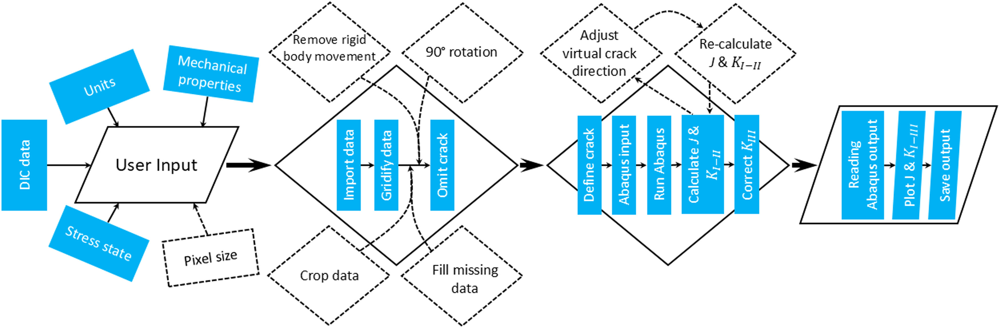
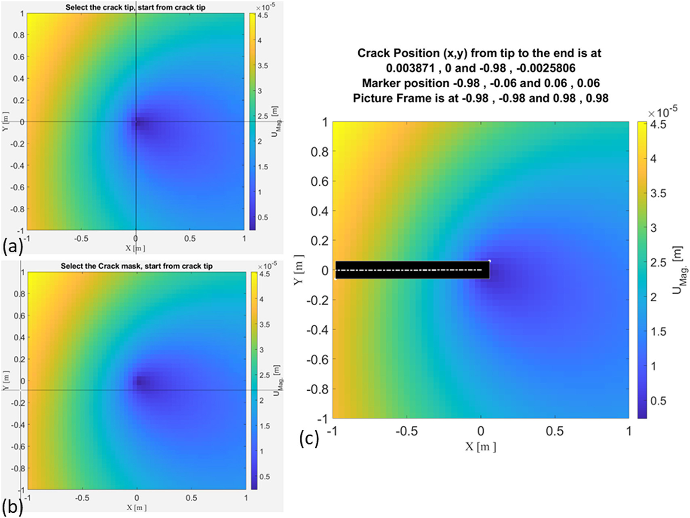
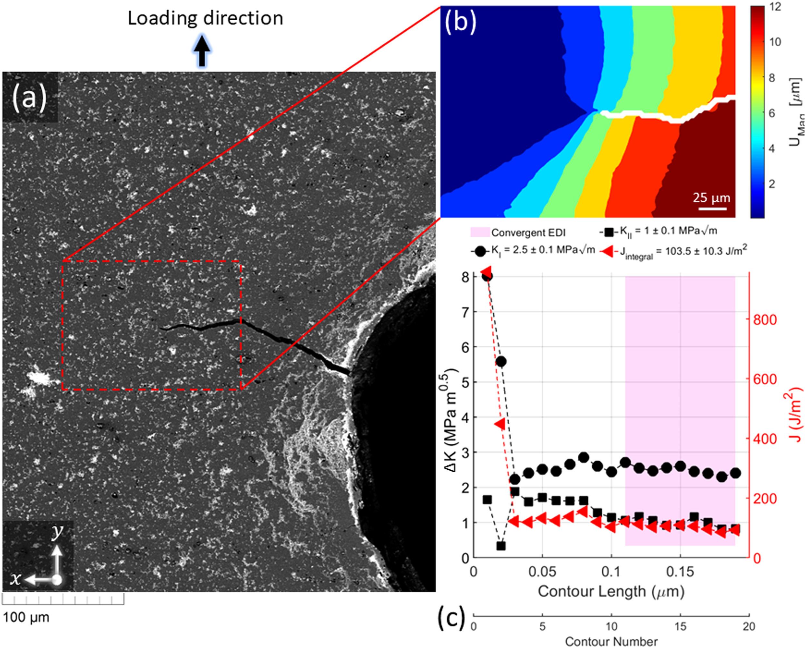
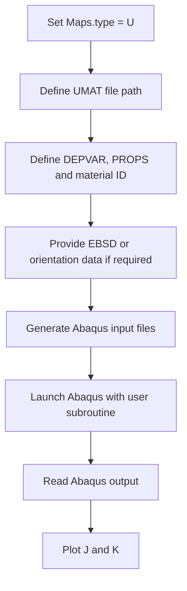
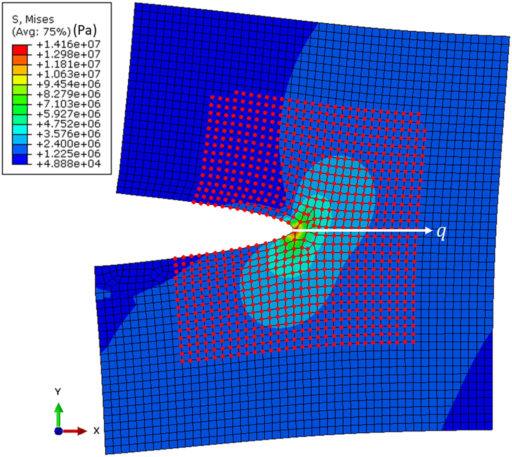
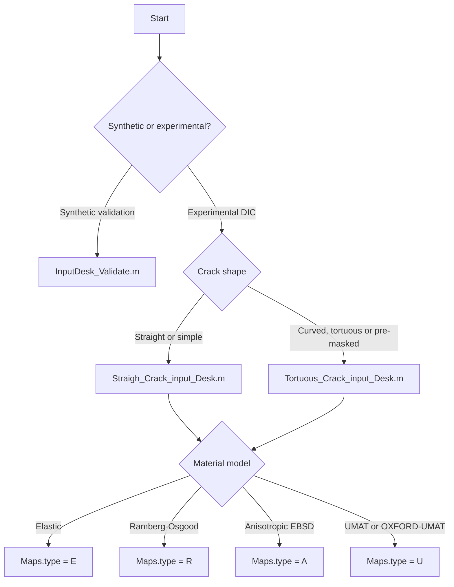

# DIC2ABAQUS

**Experimental DIC displacement fields to Abaqus fracture-integral analysis**

[](#requirements)
[](#requirements)
[](#umat-and-oxford-umat)
[](LICENSE)
[](https://doi.org/10.1016/j.softx.2025.102231)

**DIC2ABAQUS** converts 2D and stereo-DIC displacement fields into Abaqus-ready finite element models for fracture analysis. It is designed for cases where a measured displacement field, rather than an idealised specimen solution, should drive the mechanical analysis.

**Main outputs:** Abaqus model files, $J$, $K_I$, $K_{II}$, optional $K_{III}$, convergence plots, corrected crack-direction results, and MATLAB output files.

**Supported material routes:** isotropic elasticity, Ramberg-Osgood plasticity, anisotropic elasticity with EBSD/MTEX information, and user-defined Abaqus material behaviour through UMAT.

---

## Why use DIC2ABAQUS?

Classical fracture calculations often assume a clean geometry, a known crack path and ideal boundary conditions. Real DIC experiments are rarely that clean. They may include tortuous cracks, local microstructural cracks, poor correlation near crack faces, residual-stress fields or non-standard specimens.

DIC2ABAQUS uses the measured displacement field as the boundary condition for an Abaqus model. Abaqus then evaluates the domain integrals needed to obtain $J$ and mixed-mode stress intensity factors.

Use this repository when you need to:

- calculate $J$, $K_I$, $K_{II}$ and, where applicable, $K_{III}$ from DIC fields;
- analyse straight or tortuous cracks without relying on a closed-form specimen solution;
- work with 2D DIC or stereo-DIC displacement data;
- include anisotropic elasticity using EBSD/MTEX data;
- run user-defined constitutive models through Abaqus UMAT;
- validate the workflow with synthetic displacement fields before using experimental data.

---

## Workflow (excluding the UMAT)

<p align="center">
  
</p>

<p align="center">
  <sub>Workflow figure from Koko and Marrow, SoftwareX, 2025, CC BY 4.0.</sub>
</p>
---

## Repository structure

```text
DIC2ABAQUS/
├── Data/
│   └── Assets/
│       ├── 1-s2.0-S2352711025001980-gr1_lrg.jpg   # Workflow figure
│       ├── 1-s2.0-S2352711025001980-gr2_lrg.jpg   # Crack-tip and crack-mask selection
│       ├── 1-s2.0-S2352711025001980-gr3_lrg.jpg   # Abaqus FE and domain-integral example
│       ├── 1-s2.0-S2352711025001980-gr6_lrg.jpg   # Local crack DIC and convergence plot
│       └── 1-s2.0-S2352711025001980-gr7_lrg.jpg   # Arcan test and stereo-DIC setup
├── Functions/                         # MATLAB functions for DIC processing, Abaqus generation and post-processing
├── Miscellaneous/                     # Example data and supporting files
├── Non-unifrom maps/                  # Non-uniform and tortuous-crack workflow
├── OXFORD-UMAT/                       # UMAT-related files bundled with this repository
├── InputDesk_Validate.m               # Synthetic validation example
├── Straigh_Crack_input_Desk.m         # Straight-crack example input desk
├── Tortuous_Crack_input_Desk.m        # Tortuous-crack example input desk
├── EBSDsquareExample.mat              # Example EBSD/MTEX data
├── Abaqus units.png                   # Unit guidance
├── LICENSE
└── README.md
```

The repository keeps the original spellings `Straigh_Crack_input_Desk.m` and `Non-unifrom maps`. Renaming them would be neater, but all internal references would also need to be updated.

---

## Capabilities

| Capability | What it does | Typical entry point |
|---|---|---|
| Synthetic validation | Checks the workflow against a known displacement field | `InputDesk_Validate.m` |
| Straight crack analysis | Lets the user select the crack tip and crack mask interactively | `Straigh_Crack_input_Desk.m` |
| Tortuous crack analysis | Uses a field where the crack or poor-correlation region has already been removed | `Tortuous_Crack_input_Desk.m` |
| 2D and stereo-DIC | Handles in-plane and stereo displacement fields | `DIC2ABAQUS(...)` |
| Elastic material | Uses isotropic linear elasticity | `Maps.type = 'E'` |
| Ramberg-Osgood material | Uses an elastoplastic stress-strain law | `Maps.type = 'R'` |
| Anisotropic elastic material | Uses stiffness data and EBSD information | `Maps.type = 'A'` |
| UMAT material | Runs Abaqus with a user material subroutine | `Maps.type = 'U'` |
| EBSD/MTEX integration | Registers orientation information for anisotropic or crystal-plasticity analysis | `Maps.EBSDfilename`, `Maps.Reigstered` |
| Crack-direction correction | Updates the virtual crack-extension direction for corrected fracture outputs | `Adjust4Direction(...)` |

---

## Requirements

### Core requirements

- MATLAB
- Abaqus/CAE or Abaqus command line
- DIC displacement data on a regularised grid
- A working Abaqus command shortcut or command-line path

### Additional requirements for UMAT simulations

- Abaqus linked to a compatible Fortran compiler
- A valid Abaqus UMAT file, for example OXFORD-UMAT
- Correct `DEPVAR`, `PROPS`, material ID and state-variable definitions

### Additional requirements for EBSD workflows

- MTEX installed and available in MATLAB
- EBSD data registered to the DIC coordinate system, or enough information to perform registration

---

## Installation

Clone the repository:

```bash
git clone https://github.com/Shi2oon/DIC2ABAQUS.git
cd DIC2ABAQUS
```

In MATLAB, add the relevant folders:

```matlab
addpath(genpath(fullfile(pwd, 'Functions')));
addpath(genpath(fullfile(pwd, 'Miscellaneous')));
addpath(genpath(fullfile(pwd, 'Non-unifrom maps')));
```

For UMAT workflows, check that the UMAT file and Abaqus command path are valid on your machine:

```matlab
Maps.UMATfilepath = fullfile(pwd, 'OXFORD-UMAT', 'OXFORD-UMAT v3.3', 'OXFORD-UMAT.f');
Maps.abqCmdShortcutPath = 'C:\path\to\Abaqus Command.lnk';
```

---

## Input data format

For 2D DIC, the input file should contain at least:

```text
X    Y    Ux    Uy
```

For stereo-DIC, the input file should contain:

```text
X    Y    Z    Ux    Uy    Uz
```

Recommended practice:

- keep coordinates and displacement components in consistent physical units;
- set `Maps.input_unit` correctly, for example `'m'`, `'mm'` or `'um'`;
- use `Maps.pixel_size = 1` if the data are already in physical units;
- use `Maps.pixel_size` as the pixel-to-physical conversion factor if the field is still pixel-based;
- remove obvious bad DIC points before analysis;
- exclude the crack and poor-correlation region before using `DIC2ABAQUS_wNAN` for tortuous cracks.

---

## Quick start 1: synthetic validation

Run:

```matlab
InputDesk_Validate
```

The validation desk creates a synthetic displacement field with prescribed stress intensity factors:

```matlab
Maps = Calibration_2DKIII(5, 1, 3);  % KI, KII, KIII
Maps.Mat = 'Calibration';
Maps.type = 'E';
Maps.input_unit = 'um';
Maps.pixel_size = 1;
Maps.Operation = 'DIC';
Maps.stressstat = 'plane_stress';
Maps.unique = 'Calibration';

[J, KI, KII, KIII] = DIC2ABAQUS(Maps);
```

Use this first. If the validation case fails, do not move to experimental DIC. Fix the Abaqus path, MATLAB path, units or Abaqus command setup first.

---

## Quick start 2: straight crack example

Run:

```matlab
Straigh_Crack_input_Desk
```

A typical setup is:

```matlab
DataDirect = fullfile(pwd, 'Miscellaneous', '1KI-2KII-3KIII_Data.dat');
Maps.results = erase(DataDirect, '.dat');

Maps.input_unit = 'mm';
Maps.pixel_size = 1;
Maps.Operation = 'DIC';
Maps.stressstat = 'plane_stress';
Maps.unique = 'Calibration';
Maps.Mat = 'Ferrite';
Maps.type = 'E';
Maps.E = 220e9;
Maps.nu = 0.3;

Data = importdata(DataDirect);
[~, RawData] = reshapeData(Data.data * Maps.pixel_size);

Maps.X = RawData.X1;
Maps.Y = RawData.Y1;
Maps.Ux = RawData.Ux;
Maps.Uy = RawData.Uy;

[J, KI, KII, KIII] = DIC2ABAQUS(Maps);
```

Use this workflow when the crack is approximately straight and interactive crack-mask selection is acceptable.

<p align="center">
  
</p>

<p align="center">
  <sub>Interactive crack-tip and crack-mask selection from Koko and Marrow, SoftwareX, 2025, CC BY 4.0.</sub>
</p>

---

## Quick start 3: tortuous crack or non-uniform map

Run:

```matlab
Tortuous_Crack_input_Desk
```

The tortuous-crack workflow assumes that the crack geometry and poor-quality DIC region have already been excluded from the displacement field. A typical setup is:

```matlab
resultsDir = fullfile(pwd, 'Miscellaneous', 'Tortuous_Crack_Data.dat');

Maps.input_unit = 'um';
Maps.pixel_size = 1e-3;
Maps.Operation = 'DIC';
Maps.stressstat = 'plane_stress';
Maps.modelDimension = '2D';
Maps.modelThickness = 3e-3;
Maps.zElems = 3;
Maps.unique = 'Crack_in_Al_5052';
Maps.type = 'U';
```

Then call:

```matlab
[BCf, Maps.UnitOffset, Maps.stepsize] = DIC2ABAQUS_wNAN( ...
    Maps, ...
    [1375 955] * Maps.pixel_size, ...   % crack-tip coordinate
    resultsDir, ...
    180);                               % initial crack direction or angle

ABAQUS = PrintRunCode(Maps, Maps.results);
[J, K, KI, KII, Direction] = PlotKorJ(ABAQUS, Maps.E, Maps.UnitOffset);
plotJKIII(KI, KII, [], J, Maps.stepsize, Maps.input_unit);
```

This is the better workflow for curved cracks, branched cracks or fields where DIC data near the crack face are unreliable.

<p align="center">
  
</p>

<p align="center">
  <sub>Local crack analysis with DIC displacement field and contour-integral convergence from Koko and Marrow, SoftwareX, 2025, CC BY 4.0.</sub>
</p>

---

## Material models

Set the material model using:

```matlab
Maps.type = 'E';  % E, R, A or U
```

### `Maps.type = 'E'`: isotropic linear elastic

```matlab
Maps.Mat = 'Al_5052';
Maps.E = 70e9;
Maps.nu = 0.321;
```

Use this for a first clean analysis, synthetic validation or nominally elastic fracture conditions.

### `Maps.type = 'R'`: Ramberg-Osgood elastoplastic

```matlab
Maps.Mat = 'Al_5052';
Maps.E = 70e9;
Maps.nu = 0.321;
Maps.Exponent = 26.67;
Maps.Yield_offset = 1.24;
Maps.yield = 4e8;
```

Use this when plasticity is non-negligible but a crystal-plasticity UMAT is not needed.

### `Maps.type = 'A'`: anisotropic elastic

```matlab
Maps.Mat = 'Anisotropic_Al_5052';
Maps.Stiffness = [ ... ] * 1e9;
Maps.EBSDfilename = 'EBSDsquareExample.mat';
Maps.Reigstered = 0;  % repository spelling retained
```

Use this when EBSD-based orientation information is required. You need MTEX and a reliable registration between EBSD and DIC coordinates.

### `Maps.type = 'U'`: UMAT user material

```matlab
Maps.Mat = 'UserDefined_Al_5052';
Maps.depvar = 50;
Maps.materialID = 1;
Maps.PROPS = 0;
Maps.UMATfilepath = fullfile(pwd, 'OXFORD-UMAT', 'OXFORD-UMAT v3.3', 'OXFORD-UMAT.f');
Maps.abqCmdShortcutPath = 'C:\path\to\Abaqus Command.lnk';
Maps.EBSDfilename = 'EBSDsquareExample.mat';
Maps.E = 210e9; % reference value where needed for post-processing
```

Use this when the material response must be supplied to Abaqus through a user subroutine.

---

## UMAT and OXFORD-UMAT

DIC2ABAQUS can run Abaqus user-material workflows by setting:

```matlab
Maps.type = 'U';
```

The maintained OXFORD-UMAT and crystal-plasticity repository is:

> [TarletonGroup/CrystalPlasticity](https://github.com/TarletonGroup/CrystalPlasticity)  
> CP UMAT and CZM UEL for Abaqus, including OXFORD-UMAT versions and examples.

Associated paper:

> Demir, E., Martinez-Pechero, A., Hardie, C. and Tarleton, E.  
> **OXFORD-UMAT: An efficient and versatile crystal plasticity framework.**  
> *International Journal of Solids and Structures*, 307, 113110, 2025.  
> https://doi.org/10.1016/j.ijsolstr.2024.113110

### Minimal UMAT checklist

Before running `Maps.type = 'U'`, check that:

- Abaqus can compile a simple UMAT from the command line;
- Abaqus is linked to the correct Fortran compiler;
- `Maps.UMATfilepath` points to the actual `.f` or `.for` UMAT file;
- any supporting Fortran files required by the UMAT are in the compiler path;
- `Maps.depvar` matches the number of state-dependent variables required by the UMAT;
- `Maps.PROPS` and `Maps.materialID` match the UMAT input convention;
- EBSD or grain-orientation data are available if the UMAT expects them;
- `Maps.abqCmdShortcutPath` points to a valid Abaqus command shortcut or equivalent launcher.

### UMAT execution path



### Common UMAT mistakes

| Symptom | Likely cause | Fix |
|---|---|---|
| Abaqus starts but immediately exits | Wrong Abaqus command shortcut | Test Abaqus manually first |
| `user subroutine is missing` | `Maps.UMATfilepath` is wrong | Use a full absolute path to the UMAT file |
| Compilation error | Abaqus is not linked to Fortran | Fix the Abaqus-Fortran environment |
| Zero or nonsense state variables | Wrong `DEPVAR` or `PROPS` | Match the UMAT documentation exactly |
| EBSD or grain mapping fails | EBSD-DIC registration is missing | Register EBSD and DIC coordinates before running |
| Results look elastic despite UMAT | UMAT material parameters are not activated | Check material ID, crystal type and user material inputs |

---

## EBSD and MTEX notes

EBSD-based workflows are useful when anisotropy or crystal orientation matters. The critical issue is not merely having an EBSD file. The EBSD coordinate frame must be consistent with the DIC and Abaqus coordinate frames.

Use:

```matlab
Maps.EBSDfilename = 'EBSDsquareExample.mat';
Maps.Reigstered = 0;  % spelling retained from the current scripts
```

Recommended checks:

- confirm that EBSD and DIC have the same origin convention;
- confirm that x and y axes are not swapped;
- confirm whether the EBSD map must be rotated or mirrored;
- verify the scale conversion between pixel, micrometre, millimetre and metre;
- inspect assigned grain IDs before trusting stress or fracture-integral results.

---

## Output files

<p align="center">
  
</p>

<p align="center">
  <sub>Abaqus model generated from DIC data, including the displacement boundary region and virtual crack-extension direction. Figure from Koko and Marrow, SoftwareX, 2025, CC BY 4.0.</sub>
</p>

Typical outputs include:

```text
Job-<Maps.unique>.inp
Job-<Maps.unique>.odb
<Maps.unique>_J_KI_II.fig
<Maps.unique>_J_KI_II.tif
<Maps.unique>_DIC2CAE.mat
<Maps.unique>_DIC2CAE_corrected.mat
```

The MATLAB output files usually store the processed `Maps` structure and fracture outputs:

```matlab
J
K
KI
KII
KIII
Direction
```

In mathematical notation, these correspond to $J$, $K_I$, $K_{II}$ and, when available, $K_{III}$.

For tortuous cracks, the script may also suggest a corrected virtual crack-extension direction and ask whether to update the Abaqus analysis direction.

---

## Which input desk should I use?



---

## Example: replacing the material model with OXFORD-UMAT

```matlab
% User material model
Maps.type = 'U';
Maps.Mat = 'UserDefined_Al_5052';

% OXFORD-UMAT / Abaqus settings
Maps.depvar = 50;
Maps.materialID = 1;     % check the UMAT convention
Maps.PROPS = 0;          % check OXFORD-UMAT documentation

Maps.UMATfilepath = fullfile(pwd, ...
    'OXFORD-UMAT', ...
    'OXFORD-UMAT v3.3', ...
    'OXFORD-UMAT.f');

Maps.abqCmdShortcutPath = 'C:\path\to\Abaqus Command.lnk';

% EBSD / orientation data if required
Maps.EBSDfilename = 'EBSDsquareExample.mat';
Maps.Reigstered = 0;

% Reference elastic value used in some post-processing paths
Maps.E = 210e9;
```

Be strict here. If `DEPVAR`, `PROPS`, material ID or orientation input do not match the UMAT source code, Abaqus may run but the result can still be mechanically meaningless.

---

## Troubleshooting

### The displacement field is shifted, mirrored or rotated

Check the coordinate convention. DIC, EBSD, MATLAB image coordinates and Abaqus coordinates often use different axis conventions. Plot `Maps.X`, `Maps.Y`, `Maps.Ux` and `Maps.Uy` before creating the Abaqus model.

### The crack-tip position is wrong

Do not rely on visual intuition alone. Plot the displacement magnitude and inspect the local displacement discontinuity. For tortuous cracks, provide the crack-tip coordinate explicitly in the `DIC2ABAQUS_wNAN` call.

### The crack mask is too thin or misses bad DIC points

For straight cracks, adjust the interactive crack mask. For tortuous cracks, exclude the crack and poor-correlation region before importing the data. Bad DIC points near the crack face can corrupt the fracture-integral calculation.

### Abaqus fails only when UMAT is used

That is probably an Abaqus-Fortran-UMAT issue, not a DIC issue. First run a minimal Abaqus UMAT example outside DIC2ABAQUS. Then return to the full pipeline.

### The J and K curves are noisy

Likely causes:

- noisy DIC displacement near the crack tip;
- wrong crack-tip coordinate;
- wrong units;
- too small or too large domain-integral contours;
- poor mesh quality around the crack;
- wrong virtual crack-extension direction;
- plasticity or anisotropy not represented by the chosen material model.

### Values are off by orders of magnitude

Check units first. A micrometre-to-metre or millimetre-to-metre mistake will destroy the result.

---

## Good practice

- Start with `InputDesk_Validate.m`.
- Run the straight-crack example unchanged.
- Replace the example data only after the validation cases work.
- Keep one folder per sample, experiment and load step.
- Save the exact `Maps` structure used for every result.
- Plot the input displacement field before running Abaqus.
- Record whether the result used the original or corrected crack direction.
- Treat UMAT outputs as invalid until the UMAT has been verified independently.

---

## Limitations

DIC2ABAQUS does not fix poor experimental data. The result is only as credible as the displacement field, crack-tip definition, material model, mesh, unit handling and Abaqus setup.

Important limitations:

- DIC data must be sufficiently clean and regularised.
- Poor crack-face correlation should be masked or removed.
- Crack-tip identification remains a sensitive user decision.
- UMAT simulations require independent verification.
- EBSD-DIC registration errors directly affect anisotropic and crystal-plasticity results.
- The code should not be treated as a black-box crack detector.

---

## Citation

If you use DIC2Abaqus, cite:

```bibtex
@article{koko2025dic2abaqus,
  title   = {DIC2Abaqus: Calculating mixed-mode stress intensity factors from 2D and 3D-stereo displacement fields},
  author  = {Koko, Abdalrhaman and Marrow, T. James},
  journal = {SoftwareX},
  year    = {2025},
  doi     = {10.1016/j.softx.2025.102231}
}
```

If you use OXFORD-UMAT, also cite:

```bibtex
@article{demir2025oxfordumat,
  title   = {OXFORD-UMAT: An efficient and versatile crystal plasticity framework},
  author  = {Demir, Eralp and Martinez-Pechero, Alvaro and Hardie, Chris and Tarleton, Edmund},
  journal = {International Journal of Solids and Structures},
  volume  = {307},
  pages   = {113110},
  year    = {2025},
  doi     = {10.1016/j.ijsolstr.2024.113110}
}
```

### Figure attribution

The images in `Data/Assets/` are reproduced from:

> Koko, A. and Marrow, T. J. **DIC2Abaqus: Calculating mixed-mode stress intensity factors from 2D and 3D-stereo displacement fields.** *SoftwareX*, 2025. https://doi.org/10.1016/j.softx.2025.102231

They are included under the article's Creative Commons Attribution licence. Keep the citation, keep the licence attribution, and state whether any figure was modified, cropped, resized or redrawn.

---

## Licence

This repository is distributed under the MIT Licence. See [`LICENSE`](LICENSE).

---

## Acknowledgements

The workflow and application figures are from the DIC2Abaqus SoftwareX article by Koko and Marrow. The UMAT route links to the OXFORD-UMAT work maintained through the Tarleton Group crystal-plasticity repository.
