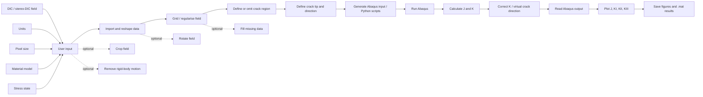
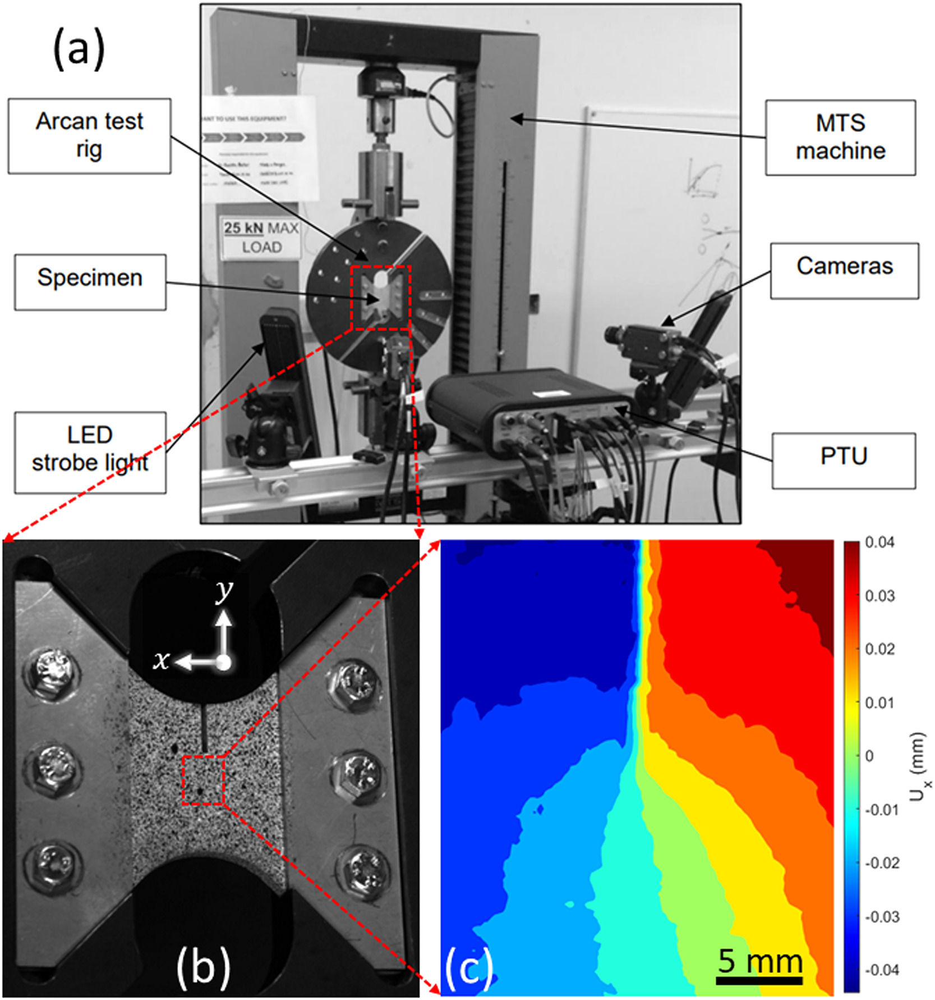
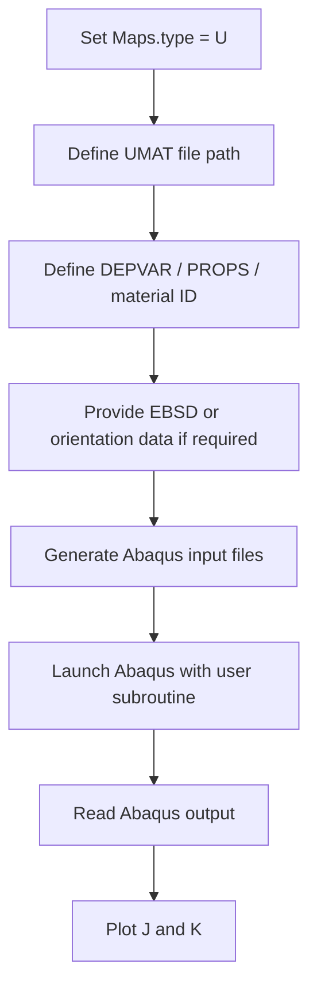
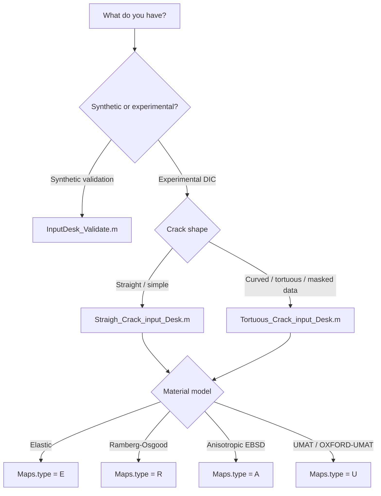

<!--
README template for Shi2oon/DIC2ABAQUS
This file is written as a polished replacement for the current repository README.
The README includes GitHub-friendly Mermaid diagrams and selected SoftwareX article figures stored in Data/Assets.
-->

<div align="center">

# DIC2ABAQUS

### From experimental DIC displacement fields to Abaqus fracture-integral analysis

**DIC2ABAQUS** converts 2D and stereo-DIC displacement fields into Abaqus-ready finite element models for evaluating fracture parameters such as the **J-integral**, **mixed-mode stress intensity factors** \(K_I, K_{II}, K_{III}\), and crack-direction-dependent quantities.

It supports conventional elastic and Ramberg-Osgood material definitions, anisotropic elasticity with EBSD/MTEX information, and user-defined material behaviour through **UMAT**, including workflows based on **OXFORD-UMAT**.

<br>

[](#requirements)
[](#requirements)
[](#umat-and-oxford-umat-workflow)
[](LICENSE)
[](https://doi.org/10.1016/j.softx.2025.102231)

<br>

**Input:** DIC field, crack location, material model, units  
**Output:** Abaqus model, calculated J, \(K_I\), \(K_{II}\), optional \(K_{III}\), and saved post-processing figures/data

</div>

---

## Why this tool exists

Classical fracture mechanics calculations usually assume a known geometry, ideal boundary conditions, and a clean crack path. Real DIC experiments rarely look like that. The displacement field may come from a non-standard specimen, a tortuous crack, a residual-stress field, an unknown loading state, or a local microstructural region where the boundary conditions are not obvious.

**DIC2ABAQUS avoids that problem by using the measured displacement field itself as the mechanical input.** The code builds an Abaqus model from the experimental field and then uses Abaqus domain-integral tools to extract fracture parameters.

Use it when you want to:

- calculate mixed-mode \(K\) and \(J\) directly from measured DIC displacement fields;
- handle straight or tortuous cracks without relying on a closed-form specimen solution;
- analyse 2D DIC or stereo-DIC fields;
- include anisotropic elasticity from EBSD/MTEX data;
- run elastoplastic or crystal-plasticity simulations through a UMAT;
- test synthetic displacement fields before applying the method to experimental data.

---

## Workflow at a glance

The schematic below summarises the DIC2Abaqus pipeline: measured displacement fields are imported, cleaned, gridded, crack-masked, converted into Abaqus input, and post-processed to obtain domain-integral quantities such as \(J\) and mixed-mode \(K\).

<p align="center">
  
</p>

<p align="center">
  <em>
  DIC2Abaqus workflow reproduced from Koko and Marrow (2025), SoftwareX, CC BY 4.0.
  Store this image at <code>Data/Assets/1-s2.0-S2352711025001980-gr1_lrg.jpg</code>.
  </em>
</p>

For a README-native version that renders directly on GitHub, the same workflow is redrawn below as a Mermaid diagram.



> **Figure note:** The image and redrawn diagram are based on Koko and Marrow, *DIC2Abaqus: Calculating mixed-mode stress intensity factors from 2D and 3D-stereo displacement fields*, SoftwareX, 2025. Keep the article citation and CC BY attribution if these figures are reused.

---

## Example applications

The figures below show the kinds of experimental and numerical workflows DIC2Abaqus is intended to support. Paths use forward slashes because GitHub Markdown is case-sensitive and renders repository-relative image paths reliably with `/`, not Windows-style `\`.

<table>
<tr>
<td width="50%" align="center">

<br>
<sub><strong>Mixed-mode experimental workflow.</strong> Arcan test setup, stereo-DIC cameras, specimen region and measured displacement field.</sub>
</td>
<td width="50%" align="center">

<br>
<sub><strong>Local crack analysis.</strong> Microstructural crack image, displacement field near the crack and converged contour-integral outputs.</sub>
</td>
</tr>
<tr>
<td width="50%" align="center">

<br>
<sub><strong>Crack definition.</strong> Interactive crack-tip and crack-mask selection used before Abaqus model generation.</sub>
</td>
<td width="50%" align="center">

<br>
<sub><strong>Abaqus execution.</strong> FE mesh, displacement boundary region and virtual crack-extension direction used for J/K extraction.</sub>
</td>
</tr>
</table>

<p align="center">
  <em>
  Application figures reproduced from Koko and Marrow (2025), SoftwareX, CC BY 4.0. The captions here are shortened and reformatted for README clarity.
  </em>
</p>

---

## Repository structure

```text
DIC2ABAQUS/
├── Data/
│   └── Assets/
│       ├── 1-s2.0-S2352711025001980-gr1_lrg.jpg   # SoftwareX workflow figure
│       ├── 1-s2.0-S2352711025001980-gr2_lrg.jpg   # Crack-tip and crack-mask selection
│       ├── 1-s2.0-S2352711025001980-gr3_lrg.jpg   # Abaqus FE / domain-integral example
│       ├── 1-s2.0-S2352711025001980-gr6_lrg.jpg   # Local crack DIC and J/K convergence
│       └── 1-s2.0-S2352711025001980-gr7_lrg.jpg   # Arcan test and stereo-DIC setup
├── Functions/                         # Main MATLAB functions for DIC processing, Abaqus generation and post-processing
├── Miscellaneous/                     # Example data and supporting assets
├── Non-unifrom maps/                  # Workflow for non-uniform / tortuous-crack maps
├── OXFORD-UMAT/                       # UMAT-related files bundled with this repository
├── InputDesk_Validate.m               # Synthetic validation example
├── Straigh_Crack_input_Desk.m         # Straight-crack example input desk
├── Tortuous_Crack_input_Desk.m        # Tortuous-crack / non-uniform map example input desk
├── EBSDsquareExample.mat              # Example EBSD/MTEX data
├── Abaqus units.png                   # Unit guidance
├── LICENSE
└── README.md
```

> Note: the file name `Straigh_Crack_input_Desk.m` and folder name `Non-unifrom maps` are kept here as they appear in the repository. Renaming them would be cleaner, but it may break existing scripts unless all internal references are also updated.

---

## Main capabilities

| Capability | What it does | Typical entry point |
|---|---|---|
| Synthetic validation | Generates a known displacement field and checks recovered \(K\) values | `InputDesk_Validate.m` |
| Straight crack analysis | Lets the code identify/omit the crack region interactively | `Straigh_Crack_input_Desk.m` |
| Tortuous crack analysis | Uses a displacement field where the crack/poor-data region has already been excluded | `Tortuous_Crack_input_Desk.m` |
| 2D and 3D-stereo DIC | Handles in-plane fields and stereo fields with out-of-plane displacement | `DIC2ABAQUS(...)` |
| Elastic material | Isotropic linear elastic fracture analysis | `Maps.type = 'E'` |
| Ramberg-Osgood material | Elastoplastic stress-strain behaviour | `Maps.type = 'R'` |
| Anisotropic elastic material | Uses stiffness matrix and EBSD data | `Maps.type = 'A'` |
| UMAT material | Runs Abaqus with a user material subroutine | `Maps.type = 'U'` |
| EBSD/MTEX integration | Registers crystal orientation data for anisotropic or CP-style analysis | `Maps.EBSDfilename`, `Maps.Reigstered` |
| Crack-direction correction | Re-evaluates virtual crack extension direction for corrected J/K values | `Adjust4Direction(...)` |

---

## Requirements

### Core requirements

- MATLAB
- Abaqus/CAE or Abaqus command line
- A DIC displacement field on a regularised grid
- A working Abaqus command shortcut/path

### For UMAT simulations

- Abaqus linked to a compatible Fortran compiler
- OXFORD-UMAT or another Abaqus UMAT file
- Correct `DEPVAR`, `PROPS`, material ID, and state-variable definitions

### For EBSD / anisotropic workflows

- MTEX installed and available in MATLAB
- EBSD data registered to the DIC coordinate system, or enough information to perform registration

---

## Installation

Clone the repository:

```bash
git clone https://github.com/Shi2oon/DIC2ABAQUS.git
cd DIC2ABAQUS
```

In MATLAB, add the required folders:

```matlab
addpath(genpath(fullfile(pwd, 'Functions')));
addpath(genpath(fullfile(pwd, 'Miscellaneous')));
addpath(genpath(fullfile(pwd, 'Non-unifrom maps'))); % needed for tortuous/non-uniform workflows
```

For UMAT workflows, confirm that the UMAT path and Abaqus command shortcut are valid on your machine:

```matlab
Maps.UMATfilepath = fullfile(pwd, 'OXFORD-UMAT', 'OXFORD-UMAT v3.3', 'OXFORD-UMAT.f');
Maps.abqCmdShortcutPath = 'C:\ProgramData\Microsoft\Windows\Start Menu\Programs\Dassault Systemes SIMULIA Abaqus CAE 2017\Abaqus Command.lnk';
```

That Windows path is only an example. You must change it for your Abaqus version and installation.

---

## Input data format

For **2D DIC**, the input file should contain at least:

```text
X    Y    Ux    Uy
```

For **stereo-DIC**, the input file should contain:

```text
X    Y    Z    Ux    Uy    Uz
```

Recommended practice:

- keep all coordinates and displacement components in consistent physical units;
- set `Maps.input_unit` correctly: `'m'`, `'mm'`, or `'um'`;
- use `Maps.pixel_size = 1` if the data are already in physical units;
- use `Maps.pixel_size` as the pixel-to-physical conversion factor if the field is still pixel-based;
- remove obvious bad DIC points before analysis;
- exclude the crack region for tortuous cracks before calling `DIC2ABAQUS_wNAN`.

---

## Quick start 1: validate the method with synthetic data

Run:

```matlab
InputDesk_Validate
```

The validation desk creates a synthetic displacement field with prescribed stress intensity factors:

```matlab
Maps = Calibration_2DKIII(5, 1, 3);  % KI, KII, KIII
Maps.Mat = 'Calibration';
Maps.type = 'E';
Maps.input_unit = 'um';
Maps.pixel_size = 1;
Maps.Operation = 'DIC';
Maps.stressstat = 'plane_stress';
Maps.unique = 'Calibration';

[J, KI, KII, KIII] = DIC2ABAQUS(Maps);
```

Use this first. If the validation case fails, do not move to experimental DIC yet. Fix the Abaqus/MATLAB path, units, or Abaqus command setup first.

---

## Quick start 2: straight crack example

Run:

```matlab
Straigh_Crack_input_Desk
```

The straight-crack workflow is intended for cases where the code can guide the user through selecting the crack tip and crack mask. A typical setup is:

```matlab
DataDirect = fullfile(pwd, 'Miscellaneous', '1KI-2KII-3KIII_Data.dat');
Maps.results = erase(DataDirect, '.dat');

Maps.input_unit = 'mm';
Maps.pixel_size = 1;
Maps.Operation = 'DIC';
Maps.stressstat = 'plane_stress';
Maps.unique = 'Calibration';
Maps.Mat = 'Ferrite';
Maps.type = 'E';
Maps.E = 220e9;
Maps.nu = 0.3;

Data = importdata(DataDirect);
[~, RawData] = reshapeData(Data.data * Maps.pixel_size);

Maps.X = RawData.X1;
Maps.Y = RawData.Y1;
Maps.Ux = RawData.Ux;
Maps.Uy = RawData.Uy;

[J, KI, KII, KIII] = DIC2ABAQUS(Maps);
```

Use this workflow when the crack is approximately straight and the crack-mask interaction is acceptable.

<p align="center">
  
</p>

<p align="center">
  <em>Interactive crack-tip and crack-mask selection. Reproduced from Koko and Marrow (2025), SoftwareX, CC BY 4.0.</em>
</p>

---

## Quick start 3: tortuous crack / non-uniform map example

Run:

```matlab
Tortuous_Crack_input_Desk
```

The tortuous-crack workflow assumes that the crack geometry and poor-quality DIC region have already been excluded from the displacement field. A typical setup is:

```matlab
resultsDir = fullfile(pwd, 'Miscellaneous', 'Tortuous_Crack_Data.dat');

Maps.input_unit = 'um';
Maps.pixel_size = 1e-3;
Maps.Operation = 'DIC';
Maps.stressstat = 'plane_stress';
Maps.modelDimension = '2D';
Maps.modelThickness = 3e-3;
Maps.zElems = 3;
Maps.unique = 'Crack_in_Al_5052';
Maps.type = 'U';
```

Then call:

```matlab
[BCf, Maps.UnitOffset, Maps.stepsize] = DIC2ABAQUS_wNAN( ...
    Maps, ...
    [1375 955] * Maps.pixel_size, ...   % crack-tip coordinate
    resultsDir, ...
    180);                               % initial crack direction / angle

ABAQUS = PrintRunCode(Maps, Maps.results);
[J, K, KI, KII, Direction] = PlotKorJ(ABAQUS, Maps.E, Maps.UnitOffset);
plotJKIII(KI, KII, [], J, Maps.stepsize, Maps.input_unit);
```

This is the better workflow for curved cracks, branched cracks, or fields where DIC data near the crack face are unreliable.

<p align="center">
  
</p>

<p align="center">
  <em>Example local crack analysis with DIC displacement field and converged J/K contours. Reproduced from Koko and Marrow (2025), SoftwareX, CC BY 4.0.</em>
</p>

---

## Material model selection

Set the material model using:

```matlab
Maps.type = 'E';  % E, R, A, or U
```

### `Maps.type = 'E'`: isotropic linear elastic

```matlab
Maps.Mat = 'Al_5052';
Maps.E = 70e9;
Maps.nu = 0.321;
```

Use this for a first clean analysis, synthetic validation, or nominally elastic fracture conditions.

### `Maps.type = 'R'`: Ramberg-Osgood elastoplastic

```matlab
Maps.Mat = 'Al_5052';
Maps.E = 70e9;
Maps.nu = 0.321;
Maps.Exponent = 26.67;
Maps.Yield_offset = 1.24;
Maps.yield = 4e8;
```

Use this when plasticity is non-negligible but you do not need a crystal-plasticity UMAT.

### `Maps.type = 'A'`: anisotropic elastic

```matlab
Maps.Mat = 'Anisotropic_Al_5052';
Maps.Stiffness = [ ... ] * 1e9;
Maps.EBSDfilename = 'EBSDsquareExample.mat';
Maps.Reigstered = 0;  % repository spelling retained
```

Use this when EBSD-based orientation information is required. You will need MTEX and a reliable registration between EBSD and DIC coordinates.

### `Maps.type = 'U'`: UMAT user material

```matlab
Maps.Mat = 'UserDefined_Al_5052';
Maps.depvar = 50;
Maps.materialID = 1;
Maps.PROPS = 0;
Maps.UMATfilepath = fullfile(pwd, 'OXFORD-UMAT', 'OXFORD-UMAT v3.3', 'OXFORD-UMAT.f');
Maps.abqCmdShortcutPath = 'C:\path\to\Abaqus Command.lnk';
Maps.EBSDfilename = 'EBSDsquareExample.mat';
Maps.E = 210e9; % placeholder/reference value where needed for post-processing
```

Use this when the material response must be provided by Abaqus through a user subroutine.

---

## UMAT and OXFORD-UMAT workflow

DIC2ABAQUS can be run with a UMAT by setting:

```matlab
Maps.type = 'U';
```

The UMAT branch is designed for Abaqus user-material workflows where material response is calculated by a Fortran subroutine rather than by a native Abaqus material card.

### Link to OXFORD-UMAT

The maintained OXFORD-UMAT / crystal-plasticity repository is:

> [TarletonGroup/CrystalPlasticity](https://github.com/TarletonGroup/CrystalPlasticity)  
> CP UMAT and CZM UEL for Abaqus, including OXFORD-UMAT versions and examples.

The associated OXFORD-UMAT paper is:

> Demir, E., Martinez-Pechero, A., Hardie, C. & Tarleton, E.  
> **OXFORD-UMAT: An efficient and versatile crystal plasticity framework.**  
> *International Journal of Solids and Structures*, 307, 113110, 2025.  
> https://doi.org/10.1016/j.ijsolstr.2024.113110

### Minimal UMAT checklist

Before running `Maps.type = 'U'`, check the following:

- Abaqus can compile a simple UMAT from the command line.
- Abaqus is linked to the correct Intel/Fortran compiler.
- `Maps.UMATfilepath` points to the actual `.f` or `.for` UMAT file.
- Supporting Fortran files required by the UMAT are in the same folder or compiler path.
- `Maps.depvar` matches the number of state-dependent variables required by the UMAT.
- `Maps.PROPS` and `Maps.materialID` match the UMAT's expected material input convention.
- EBSD orientation data are available if the UMAT/material definition expects grain orientation.
- The Abaqus command shortcut in `Maps.abqCmdShortcutPath` is valid.

### UMAT execution path



### Common UMAT mistakes

| Symptom | Likely cause | Fix |
|---|---|---|
| Abaqus starts but immediately exits | Wrong Abaqus command shortcut | Test Abaqus command manually first |
| `user subroutine is missing` | `Maps.UMATfilepath` is wrong | Use a full absolute path to the UMAT file |
| Compilation error | Abaqus not linked to Fortran compiler | Fix Abaqus-Fortran compiler environment |
| Zero or nonsense state variables | Wrong `DEPVAR` or `PROPS` | Match UMAT documentation exactly |
| EBSD/grain mapping fails | EBSD-DIC registration missing | Register EBSD and DIC coordinates before running |
| Results look elastic despite UMAT | UMAT material parameters not activated | Check material ID, crystal type, and user material input files |

---

## EBSD and MTEX notes

EBSD-based workflows are useful when anisotropy or crystal orientation matters. They are also easy to misuse. The critical issue is not simply having an EBSD file. The EBSD coordinate frame must be consistent with the DIC/Abaqus coordinate frame.

Use:

```matlab
Maps.EBSDfilename = 'EBSDsquareExample.mat';
Maps.Reigstered = 0;  % spelling retained from the current scripts
```

Recommended checks:

- confirm that EBSD and DIC have the same origin convention;
- confirm that x/y axes are not swapped;
- confirm whether the EBSD map must be rotated or mirrored;
- verify the scale conversion between pixel, micrometre, millimetre and metre;
- inspect the assigned grain IDs before trusting stress or J/K results.

---

## Output files

<p align="center">
  
</p>

<p align="center">
  <em>Example Abaqus model generated from DIC data, including the displacement boundary region and virtual crack-extension direction. Reproduced from Koko and Marrow (2025), SoftwareX, CC BY 4.0.</em>
</p>

Typical outputs include:

```text
Job-<Maps.unique>.inp
Job-<Maps.unique>.odb
<Maps.unique>_J_KI_II.fig
<Maps.unique>_J_KI_II.tif
<Maps.unique>_DIC2CAE.mat
<Maps.unique>_DIC2CAE_corrected.mat
```

The `.mat` files usually store the processed `Maps` structure and fracture outputs such as:

```matlab
J
K
KI
KII
KIII
Direction
```

For tortuous cracks, the script may also suggest a corrected virtual crack-extension direction and ask whether to update the Abaqus analysis direction.

---

## Choosing the correct input desk



---

## Example: replacing the material model with OXFORD-UMAT

```matlab
% --- User material model ---
Maps.type = 'U';
Maps.Mat = 'UserDefined_Al_5052';

% --- OXFORD-UMAT / Abaqus settings ---
Maps.depvar = 50;
Maps.materialID = 1;     % check the UMAT convention
Maps.PROPS = 0;          % check OXFORD-UMAT documentation

Maps.UMATfilepath = fullfile(pwd, ...
    'OXFORD-UMAT', ...
    'OXFORD-UMAT v3.3', ...
    'OXFORD-UMAT.f');

Maps.abqCmdShortcutPath = ...
    'C:\ProgramData\Microsoft\Windows\Start Menu\Programs\Dassault Systemes SIMULIA Abaqus CAE 2017\Abaqus Command.lnk';

% --- EBSD / orientation data if required ---
Maps.EBSDfilename = 'EBSDsquareExample.mat';
Maps.Reigstered = 0;

% --- Reference elastic value used in some post-processing paths ---
Maps.E = 210e9;
```

Be strict here: if `DEPVAR`, `PROPS`, material ID or orientation input do not match the UMAT source code, Abaqus may run but the result can still be mechanically meaningless.

---

## Troubleshooting

### My field is shifted, mirrored or rotated

Check the coordinate convention. DIC, EBSD, MATLAB image coordinates and Abaqus coordinates often use different axis conventions. Plot `Maps.X`, `Maps.Y`, `Maps.Ux` and `Maps.Uy` before creating the Abaqus model.

### My crack-tip position is wrong

Do not rely on visual intuition alone. Plot the displacement magnitude and inspect the local displacement discontinuity. For tortuous cracks, provide the crack-tip coordinate explicitly in the `DIC2ABAQUS_wNAN` call.

### The crack mask is too thin or misses bad DIC points

For straight cracks, adjust the interactive crack mask. For tortuous cracks, exclude the crack and poor-correlation region before importing the data. Bad DIC points near the crack face are one of the easiest ways to poison the J/K calculation.

### Abaqus fails only when I use UMAT

That is almost certainly an Abaqus-Fortran-UMAT issue, not a DIC issue. First run a minimal Abaqus UMAT example outside DIC2ABAQUS. Then come back to the full pipeline.

### My J/K curves are noisy

Likely causes:

- noisy DIC displacement near the crack tip;
- wrong crack-tip coordinate;
- wrong units;
- too small or too large domain-integral contours;
- poor mesh quality around the crack;
- wrong virtual crack-extension direction;
- plasticity or anisotropy not represented by the chosen material model.

### My values are off by orders of magnitude

Check units first. A micrometre-to-metre or millimetre-to-metre mistake will destroy the result.

---

## Good practice

- Start with `InputDesk_Validate.m`.
- Then run the straight-crack example unchanged.
- Only then replace the example data with your DIC field.
- Keep one folder per experiment/sample/load step.
- Save the exact `Maps` structure used for every result.
- Plot the input field before running Abaqus.
- Record whether the result used the original or corrected crack direction.
- Treat UMAT outputs as invalid until you have verified the UMAT independently.

---

## Limitations

DIC2ABAQUS does not magically fix bad experimental data. The output is only as credible as the displacement field, crack-tip definition, material model, mesh, and unit handling.

Important limitations:

- DIC data must be sufficiently clean and regularised.
- Poor crack-face correlation should be masked or removed.
- Crack-tip identification remains a sensitive user decision.
- UMAT simulations require independent verification.
- EBSD-DIC registration errors directly contaminate anisotropic and crystal-plasticity results.
- The code should not be treated as a black-box crack detector.

---

## Citing DIC2Abaqus

If you use this code in academic work, cite:

```bibtex
@article{koko2025dic2abaqus,
  title   = {DIC2Abaqus: Calculating mixed-mode stress intensity factors from 2D and 3D-stereo displacement fields},
  author  = {Koko, Abdalrhaman and Marrow, T. James},
  journal = {SoftwareX},
  year    = {2025},
  doi     = {10.1016/j.softx.2025.102231}
}
```

If you use OXFORD-UMAT, also cite:

```bibtex
@article{demir2025oxfordumat,
  title   = {OXFORD-UMAT: An efficient and versatile crystal plasticity framework},
  author  = {Demir, Eralp and Martinez-Pechero, Alvaro and Hardie, Chris and Tarleton, Edmund},
  journal = {International Journal of Solids and Structures},
  volume  = {307},
  pages   = {113110},
  year    = {2025},
  doi     = {10.1016/j.ijsolstr.2024.113110}
}
```

### Figure attribution

The README images stored in `Data/Assets/` are reproduced from:

> Koko, A. & Marrow, T. J. **DIC2Abaqus: Calculating mixed-mode stress intensity factors from 2D and 3D-stereo displacement fields.** *SoftwareX*, 2025. https://doi.org/10.1016/j.softx.2025.102231

They are included under the article's Creative Commons attribution licence. Keep the citation, keep the licence attribution, and state whether you modified, cropped, resized, or redrew any figure.

---

## Licence

This repository is distributed under the MIT Licence. See [`LICENSE`](LICENSE).

---

## Acknowledgements

This README was written to make the repository easier to use, especially for users working with fracture mechanics, DIC, EBSD/MTEX, Abaqus, and UMAT-based constitutive models.

The workflow and application figures are from the DIC2Abaqus SoftwareX article and should be attributed when reused.

